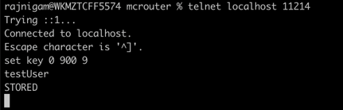

# Setup cache infrastructure for handle 5 billion requests per second at peak 
- This blog aims at proposing infrastructure blueprint around Mcrouter (pronounced mc router) and demonstrate its coexistence with microservices.

## Target Audience 
- Architects who are aware of 'how cache works?' and know relevant use cases.
- Technologists working on optimizing Reads calls on data that reside locally or can be accessible over 3rd party APIs.
- Developers facing scalability issues with cache layer.
- Platform Engineers looking for key-value store alternatives other than **etcd** for creating highly scalable devOps tools.
## Scope
- The scope of this blog is limited around Memcached cache and scalability benefits of placing it behind **Mcrouter**.
- Future scope is to find similar alternatives for redis like **twemproxy**.
## Problem Statement
- Memcached is only vertically scalable. Design a solution that can achieve horizontal scalability with Memcached.
- The clients (eg. Microservices) should not worry about tracking horizontally scaling instances of Memcached.
- The solution must sustain traffic load similar to websites like Facebook, Instagram, or Crypto Exchanges.
## Introduction
- Mcrouter is a memcached based cache broker ease horizontally replicate cache data across ever-growing memcached instances. 
- As it's natively developed in C++ and runs on top of GCC, which reduce the trans compilation time complexity to the lowest. 
- The client apps can connect to Mcrouter on memcached protocol, and eventually it acts like a Facade that hides complexities of replication and fetching the cached data.
- Developed and maintained by Facebook, Mcrouter has successfully benchmarked on the scale of 5 Bn requests per second. 
## Infrastructure Blueprint

## Step-By-Step Setup 
- For the sake of simplicity and quick POC the following scripts are meant to be executed on local docker engine and can be converted into docker swarm or Kubernetes deployment manifests.
- Spawn 3 docker instances of memcahed
```
 docker run -it -p 11211:11211 memcached:alpine3.15
 docker run -it -p 11212:11211 memcached:alpine3.15
 docker run -it -p 11213:11211 memcached:alpine3.15
```
- Use **ifconfig** and locate the machine ip bind with network interface card. For my machine, its  bind with *eth0* slot.
- After industry-wide log4j vulnerability episode and because of increasing threat of ransomwares getting spawned now or then, I've stopped using docker containers from Docker hub. Following is the Dockerfile for Mcrouter.
```
FROM            ubuntu:18.04

RUN             mkdir -p /etc/apt && touch /etc/apt/sources.list
RUN             apt-get update && apt-get -y install sudo wget gnupg2 autoconf
RUN             sudo wget -O - https://facebook.github.io/mcrouter/debrepo/bionic/PUBLIC.KEY |  apt-key add -
RUN             echo "deb https://facebook.github.io/mcrouter/debrepo/bionic bionic contrib" >> /etc/apt/sources.list
RUN             apt-get update && apt-get -y install mcrouter
RUN             useradd -u 8877 nobody
USER            nobody
ENTRYPOINT      ["mcrouter"]
```
- * Assuming the target audience is well verse with containerisation concepts, I'm skipping the container creation steps.
- Spawn Mcrouter using the following command
```
docker run -it -p 11214:11214 mcrouter --config-str='{"pools":{"A":{"servers":["<MACHINE_IP>:11211","<MACHINE_IP>:11212","<MACHINE_IP>:11213"]}}, "route": { "type": "OperationSelectorRoute", "operation_policies": { "add": "AllInitialRoute|Pool|A", "delete": "AllSyncRoute|Pool|A", "get": "AllSyncRoute|Pool|A", "gets": "AllSyncRoute|Pool|A", "set": "AllSyncRoute|Pool|A"}} }' -p 11214
```
## Validate Setup
- Mcrouter is accessible on port 11214.
- 3 Instances of Memcached are accessible on 11211,11212,11213.
- Verifying Writes
- 
- 
- 
- Verifying Reads
- 
## Conclusion
- Mcrouter successfully replicates cache data across horizontally spawned memcached instances.
- Mcrouter successfully reads cache data from memcached instances.
- Hence, Mcrouter assist memcached to scale horizontally.
## References
- https://github.com/rajat965ng/spring-boot-mcrouter.git
- https://github.com/facebook/mcrouter